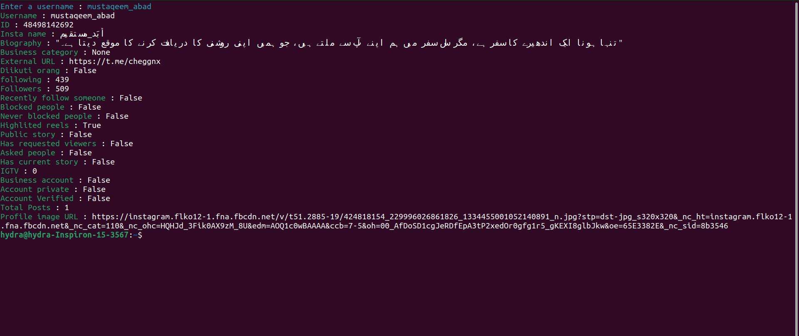

# Insta Info Tool by NX

An Instagram information tool that allows you to retrieve details about a user using Instaloader.




## Table of Contents
- [Description](#description)
- [Installation](#installation)
- [Usage](#usage)
- [Dependencies](#dependencies)
- [Disclaimer](#disclaimer)
- [Contributing](#contributing)
- [License](#license)

## Description

This tool provides information about an Instagram user, such as their username, user ID, full name, biography, business category, and more. It utilizes the Instaloader library for Instagram data retrieval.

**Note**: Use this tool responsibly, and make sure to comply with Instagram's terms of service.

## Installation

Make sure you have Python installed. Install the required dependencies using:

```bash
pip install gamerinsta pyfiglet instaloader requests
```

## Usage

1. Run the script:

```bash
python insta_info_tool.py
```

2. Enter your Instagram username and password when prompted.

3. Follow the instructions to join a Telegram channel.

4. Provide the username of the Instagram account you want to gather information about.

5. The script will display various details about the specified Instagram user.

## Dependencies

- [gamerinsta](https://pypi.org/project/gamerinsta/)
- [pyfiglet](https://pypi.org/project/pyfiglet/)
- [instaloader](https://pypi.org/project/instaloader/)
- [requests](https://pypi.org/project/requests/)

## Disclaimer

This tool is for educational and informational purposes only. Use it responsibly and adhere to Instagram's terms of service. The developer is not responsible for any misuse or violations.

## Contributing

Feel free to contribute to the project by submitting issues or pull requests.

## License

This project is licensed under the [MIT License](LICENSE).
